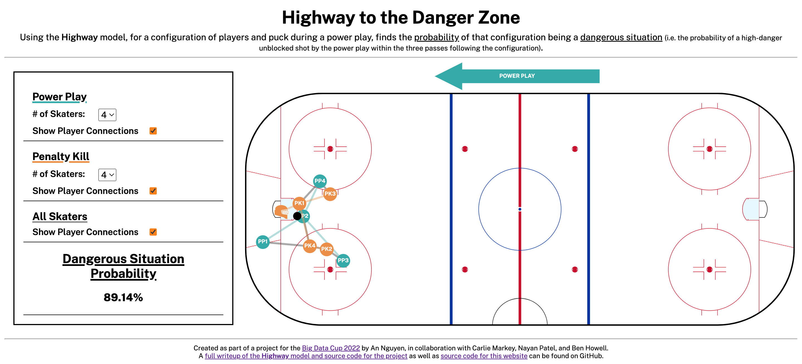

# bdc22-mst-website

An interactive webtool, [available here](https://highway-to-the-danger-zone.netlify.app/), utilizing the Highway model created by Carlie Markey, Nayan Patel, An Nguyen, and Ben Howell.

The Highway model and this webtool were created as part of a project for the Big Data Cup 2022. A writeup of the Highway model and the full source code for the project is [available here](https://github.com/nguyenank/bdc22-mst).
